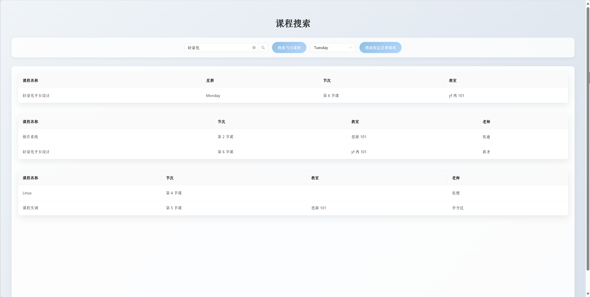
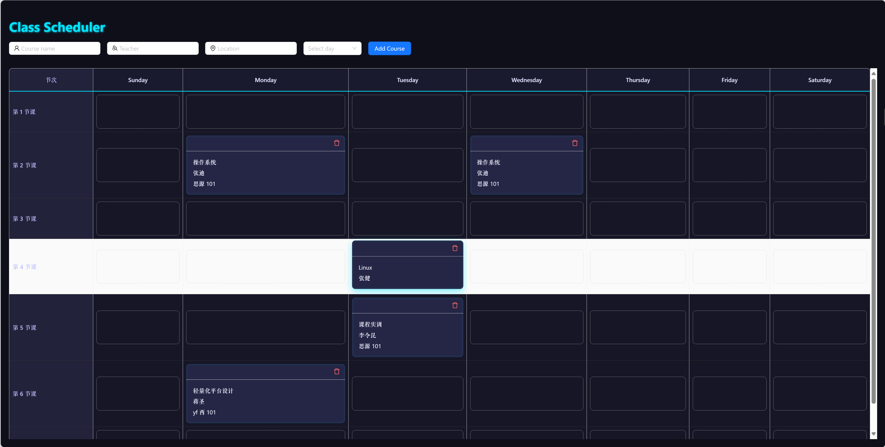
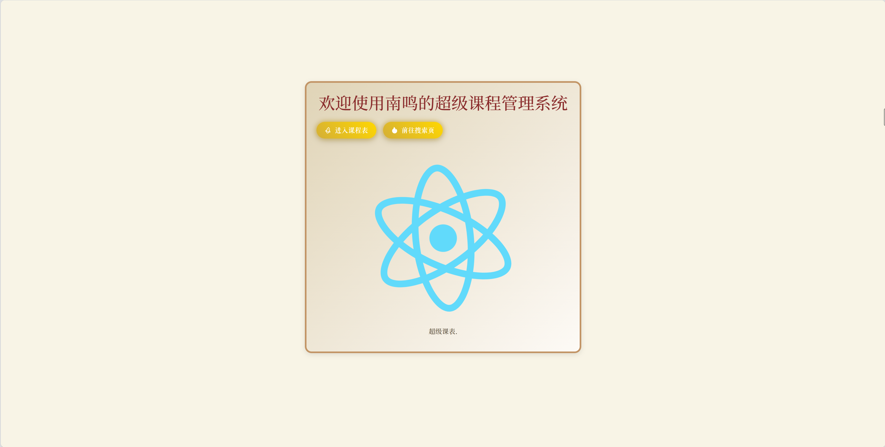

# Class Scheduler

## 功能介绍
- 可通过表单输入课程名称、教师、地点，并选择星期添加课程
- 支持在课程表中拖拽课程卡片，实现调整课程顺序
- 在卡片右上角点击删除按钮，可删除对应课程
- 所有课程数据会自动保存到本地 `localStorage`，刷新或重启浏览器后仍然保留
- 新增搜索页面（Search）：  
  - 按课程名称输入框进行子序列匹配搜索，实时展示匹配课程的名称、星期、节次和教室  
  - “搜索当日课程”按钮：列出当天所有课程，展示课程名称、节次、上课地点和教师  
  - 选择星期后点击“搜索指定星期课程”按钮：列出所选周几的课程，展示课程名称、节次、上课地点和教师

## 异常情况 & 边界处理
- 添加课程时若所选天所有时段已占用，会弹出提示：`该天没有空余时间！`
- 拖拽至已被占用的格子时会取消操作，保持原有顺序
- 拖拽过程中禁止默认浏览器拖拽预览，确保交互流畅
- 表单校验
  - 课程名称为必填
  - 星期必须选择
- 界面尺寸自适应，高度超出自动滚动，不会破坏布局

## 使用方式
1. 克隆仓库并进入项目目录  
   ```bash
   git clone <repo-url>
   cd class_table/class_table
   ```
2. 安装依赖  
   ```bash
   npm install
   ```
3. 启动开发服务器  
   ```bash
   npm start
   ```  
   打开浏览器访问 http://localhost:3000
4. 在表单中填写课程信息并选择星期，点击 **Add Course**  
5. 在课程表中拖拽调整位置，或点击卡片右上角删除课程  
6. 数据会自动保存在本地，刷新页面后仍可查看  

---

## 截图

- 搜索页面  
  

- 课程表页面  
  


- 导航页
  
